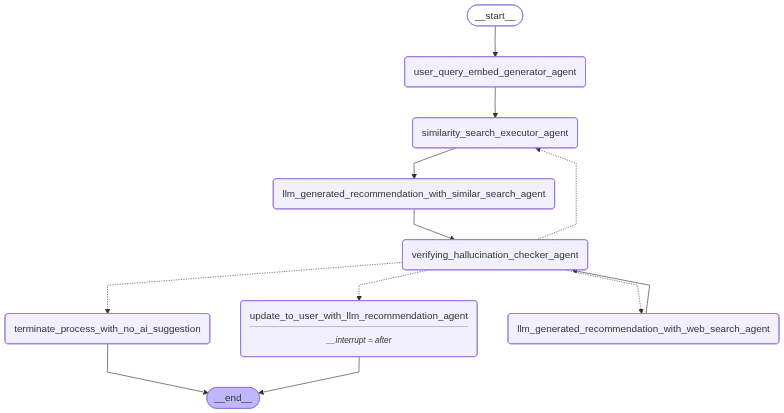

# ai_ops_pd

**ai_ops_pd** is a Python-based project designed to provide AI-powered operational insights, facilitate incident analysis, and streamline automated workflows for IT operations. The repository includes data generation, workflow automation, logging configuration, and user interface components, making it suitable for experimentation, prototyping, or operational data analysis.

## Features

- **Incident Data Generation:** Scripts to generate and mock production incident datasets.
- **Workflow Automation:** Automates incident analysis and operations workflows.
- **Logging & Monitoring:** Customizable logging configuration for debugging and audit trails.
- **Vector Database Operations:** Integrates with vector databases for efficient data retrieval.
- **User Interface:** UI script for interactive use.
- **Sample Data:** Includes a sample SQL Server incident CSV file for demonstration and testing.


## Prerequisites

- Python 3.11 or above
- pip (Python package installer)

## Installation & Setup

1. **Clone the repository:**

   ```bash
   git clone https://github.com/bhuwanthada/ai_ops_pd.git
   cd ai_ops_pd
   ```

2. **Install required Python packages:**

   ```bash
   pip install -r req.txt
   ```

3. **(Optional) Review and adjust configuration files** (if any, e.g., `logging_config.py`).

## Usage

- **Run the main application:**

  ```bash
  python main.py
  ```

- **Generate mock incident records:**

  ```bash
  python generate_mock_pd_records.py
  ```

- **Database operations:**

  ```bash
  python gen_db.py
  ```

- **Launch the REST API:**

  ```bash
  uvicorn manage:app --reload
  ```

- **Launch the user interface:**

  ```bash
  streamlit run ui.py
  ```

- **Other scripts** can be run similarly for individual functionalities.

## Data

A sample incident data file, `sqlserver_incidents.csv`, is included for testing and demonstration purposes.

## Workflow



## License

This project currently does not specify a license. Please contact the repository owner for usage guidelines.

---

For further details, explore individual scripts and modules within the repository.
